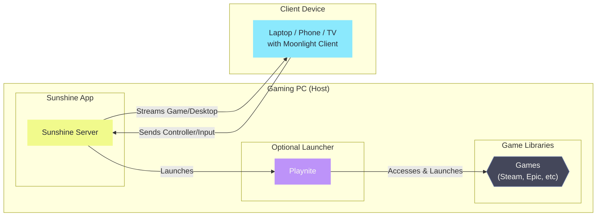

## 🎮 Guide: Sunshine & Moonlight Local Streaming Guide

This guide will walk you through setting up a powerful and open-source game streaming solution for your home network. We'll use [Sunshine](https://app.lizardbyte.dev/Sunshine) as the streaming server (host) on your gaming PC and [Moonlight](https://moonlight-stream.org/) as the client on your other devices.

### 🤔 How It Works

-   **[Sunshine](https://app.lizardbyte.dev/Sunshine)**: This application runs on your main gaming PC. It captures your game or entire desktop, encodes it into a video stream, and sends it over your local network. It's a feature-rich, open-source alternative to NVIDIA's GameStream or AMD Link.
-   **[Moonlight](https://moonlight-stream.org/)**: This is the client application you'll install on your other devices (like a laptop, phone, or even a smart TV). It receives the video stream from Sunshine, allowing you to see and control your host PC remotely with very low latency.
-   **[Playnite](https://playnite.link/) (Optional but Recommended)**: This is a unified game library launcher. By launching Playnite through Sunshine, you can access all your games from any storefront (Steam, Epic, GOG, etc.) in one clean interface on your client device, rather than adding each game individually to Sunshine.

---

### 📊 Visual Flowchart

Here’s a visual representation of how the pieces connect:

## 🖥️ Step 1: Configure the Host PC (Your Gaming Computer)

The first step is to set up Sunshine on the PC you want to stream *from*.

1.  📥 **Download and Install Sunshine**:
    *   Go to the official [Sunshine download page](https://github.com/LizardByte/Sunshine/releases).
    *   Download the latest stable version for your operating system (e.g., Windows).
    *   Run the installer and follow the on-screen prompts.

2.  ⚙️ **Initial Sunshine Configuration**:
    *   After installation, Sunshine will be running in the background. To configure it, open a web browser and navigate to: `https://localhost:47990`.
    *   The first time you connect, you'll be prompted to create a username and password for the Sunshine web interface. **Do not forget these credentials.**
    *   Log in with the credentials you just created.

3.  📚 **(Optional) Integrate Playnite for a Unified Library**:
    *   If you don't have it already, download and install **[Playnite](https://playnite.link/)**. It's a fantastic tool for managing all your PC games in one place.
    *   In the Sunshine web UI, go to the **"Applications"** tab. You can find it at `http://localhost:47990/applications`.
    *   Click **"Add New"**.
    *   For the "Application Name", type something descriptive like `Playnite Fullscreen`.
    *   For the "Command", you need to provide the path to Playnite's fullscreen mode executable. It typically looks like this:
        *   `"C:\Users\YourUsername\AppData\Local\Playnite\Playnite.FullscreenApp.exe"`
    *   Click **"Save"**. Now, Playnite will appear as a launchable "game" in Moonlight, giving you access to your entire library.

4. ✨ **(Optional) Install a Virtual Display Driver**

    If you plan to run your host PC without a monitor attached (headless), or if you want to stream at a resolution that your physical monitor doesn't support, you'll need a virtual display driver.

    1. 📥 **Download the Driver**:
        *   Go to the [Virtual-Display-Driver](https://github.com/VirtualDrivers/Virtual-Display-Driver/releases) releases page on GitHub.
        *   Download the `VDD.Control.*.zip` Controller from the latest release.
    2. ⚙️ **Install the Driver**:
        *   Run the installer from the controller. Your screen may flash or temporarily go black, which is normal.
        *   Once installed, Windows will see a new virtual monitor that Sunshine can use for streaming. You can manage its resolution from the Windows Display Settings, just like a physical monitor.

## 📱 Step 2: Configure the Client Device(s)

Now, set up Moonlight on the device you want to stream *to*.

### 💻 For a Desktop Client (Windows, macOS, Linux)

1.  📥 **Download and Install [Moonlight-Qt](https://github.com/moonlight-stream/moonlight-qt)**:
    *   Go to the official [Moonlight](https://github.com/moonlight-stream/moonlight-qt) download page and find the client for your device.
    *   Download and install the appropriate version for your operating system.

2.  🛜 **Connect to Your Host PC**:
    *   Ensure your client device is on the same network as your host PC.
    *   Open Moonlight. It should automatically detect your Sunshine host PC on the network.
    *   If it doesn't, you can manually add it by clicking the "Add PC" button and entering the local IP address of your host PC.
    *   Click on your host PC's icon in Moonlight. A **PIN** will be displayed on your client device.
    *   On your **host PC**, go back to the Sunshine web UI. A "PIN" tab should have appeared. Enter the PIN from your client device here and click "Send".
    *   Your devices are now paired! You will see a list of available applications, including the Playnite entry you created earlier.

### 📺 For an LG TV (webOS)

Setting up Moonlight on an LG TV requires enabling developer mode first.

1.  🧑‍💻 **Enable Developer Mode on your LG TV**:
    *   Follow the official LG guide to enable Developer Mode on your TV. This usually involves installing the "Developer Mode" app from the LG Content Store and signing in with a developer account.

2.  ⚙️ **Install the WebOS Dev Manager**:
    *   On your computer, download and install the **[WebOS Dev Manager](https://github.com/webosbrew/dev-manager-desktop)**. This tool allows you to easily install third-party apps on your TV.

3.  📺 **Install Moonlight on the TV**:
    *   Open the WebOS Dev Manager on your computer and connect to your TV.
    *   Download the latest Moonlight for webOS package (`.ipk` file) from the official releases page.
    *   Use the "Install" button in the Dev Manager to upload and install the `.ipk` file onto your TV.
    *   The Moonlight app will now be available on your TV's launcher bar.

4.  🛜 **Connect to Your Host PC**:
    *   The pairing process is the same as with the desktop client. Launch Moonlight on your TV, it will show you a PIN, and you enter that PIN into the Sunshine web UI on your host PC.

## 🎉 Step 3: Start Streaming!

With everything configured, you're ready to play.

1.  Launch the Moonlight application on your client device.
2.  Click on your paired host PC.
3.  Select the game or application (like Playnite) you wish to launch.
4.  The stream will begin, and you can now play your PC games remotely!

### 💡 Tips for the Best Experience
*   **Wired is Better**: For the most stable, low-latency experience, connect both your host PC and your client device to your router using an Ethernet cable.
*   **Use 5GHz Wi-Fi**: If you must use Wi-Fi, ensure your devices are connected to a 5GHz network, as it's much faster and less prone to interference than 2.4GHz.
*   **Adjust Settings**: In the Moonlight client settings, you can adjust the bitrate and resolution to find the perfect balance between image quality and performance for your network.